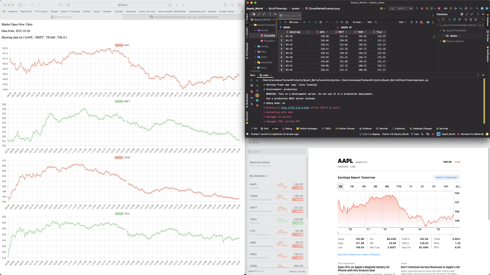

 # Stock Ticker App
 
- The Stock Ticker App is a project to display skills in:
  - Backend Python
  - Web App Development
  - SQL Databases
  - Frontend Javascript and HTML

- The app uses a Web App to display live or the previous days stock data for given tickers.
  - It uses Python to gather the stock data and store it in a Database and host the app. 
  - JS is then used to fetch the data from the database through python and display the stock data
 
 

- Project is at a basic functionality stage
- Future updates will show extra market data and hopefully some time series analysis and stock predictions
