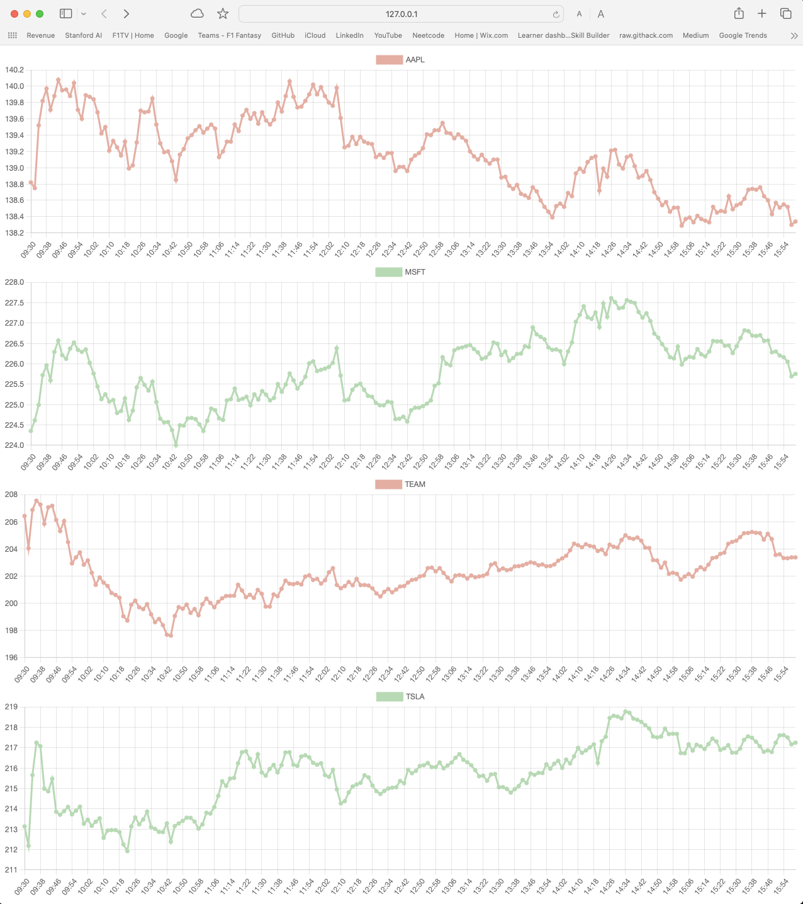

 # Stock Ticker App
 
- Stock Ticker App is Full Stack Web App project using Python, Javascript, HTML and SQL.
-  The goal of the App is to display stock data for some selection of stock tickers to a webpage with the addition of some extra functionality
- As of the last commit the first working example has been posted
  - The App loads data to a SQL database if needed, then uses Flask to give the Javascript file access to the data from the Database
  - The Javascript file fetches the data then displays it to the webpage
 
 

- This is very basic functionality right now and is currently for proof oc concept and to improve my skills
- The planned features will be dynamic charts showing live ticker data when the markets are open
- Choice between datetime range selection e.g 1d, 1w, 1y etc

- Once the main functionality is complete some Deep learning, Time series forecasting etc is also planned
